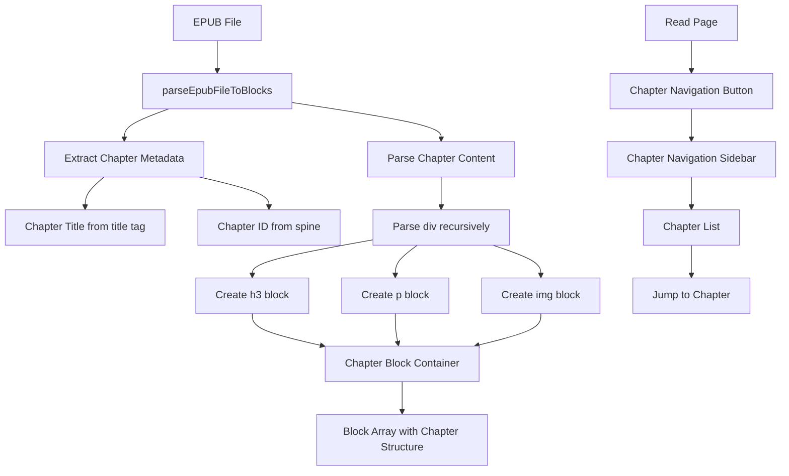

# EPUB 解析增强设计文档

## 概述

本设计文档描述了如何改进现有的 EPUB 解析功能，实现基于章节的内容结构和章节导航侧边栏。主要改进包括：1) 重构 EPUB 解析器以支持章节级别的内容组织；2) 实现章节导航 UI 组件；3) 增强章节元数据管理。

## 架构

### 模块化设计原则

- **单一职责**: 每个函数专注于单一解析任务（提取标题、解析元素、创建 blocks）
- **组件隔离**: 章节导航组件独立于阅读器主体
- **服务层分离**: EPUB 解析逻辑与 UI 展示完全分离
- **数据结构清晰**: 章节元数据与内容 blocks 明确关联



## 组件和接口

### Enhanced EPUB Parser

**目的**: 解析 EPUB 文件为带有章节结构的 Block 数组

**接口**:

```typescript
interface ParsedEpubContent {
  blocks: Block[]; // 扁平化的所有内容 blocks（h3、p、img 等）
  chapters: ChapterMetadata[]; // 章节元数据列表
}

interface ChapterMetadata {
  id: string; // 章节唯一标识符（来自 EPUB spine）
  title: string; // 章节标题（来自 <title> 元素）
  index: number; // 章节序号（从 0 开始）
  blockStartIndex: number; // 该章节在 blocks 数组中的起始索引
  blockEndIndex: number; // 该章节在 blocks 数组中的结束索引（不包含）
}
```

**依赖**: JSZip, DOMParser, 现有的图片处理函数

**复用**: 现有的 `blobToDataURL`, `resolvePath`, `parseXML` 函数

### Chapter Navigation Sidebar Component

**目的**: 提供章节列表和快速跳转功能

**接口**:

```typescript
interface ChapterNavigationProps {
  chapters: ChapterMetadata[];
  currentChapterIndex: number;
  onChapterSelect: (chapterIndex: number) => void;
  isOpen: boolean;
  onClose: () => void;
}
```

**依赖**: shadcn/ui Sheet 组件, ScrollArea 组件

**复用**: 现有的 Button, Sheet, ScrollArea UI 组件

### Enhanced Read Page

**目的**: 集成章节导航功能到阅读页面

**新增状态**:

```typescript
const [chapters, setChapters] = useState<ChapterMetadata[]>([]);
const [currentChapterIndex, setCurrentChapterIndex] = useState<number>(0);
const [showChapterNav, setShowChapterNav] = useState<boolean>(false);
```

**依赖**: ChapterNavigationSidebar 组件

## 数据模型

### Block 扁平化结构

EPUB 解析后，所有内容 blocks（h3、p、img 等）将被扁平化到一个数组中，不使用嵌套的 chapter block。章节信息通过独立的元数据数组管理。

```typescript
// 不再使用 ChapterBlock，而是使用扁平化的 Block 数组
type Block = HtmlBlock | ImageBlock | VideoBlock | ParagraphBlock;
```

### ChapterMetadata 模型

```typescript
interface ChapterMetadata {
  id: string; // 章节唯一标识符
  title: string; // 章节标题
  index: number; // 章节序号（从 0 开始）
  blockStartIndex: number; // 在扁平化 blocks 数组中的起始索引
  blockEndIndex: number; // 在扁平化 blocks 数组中的结束索引
}
```

### 存储格式

```typescript
interface StoredBookContent {
  __type: 'blocks';
  blocks: Block[]; // 扁平化的内容 blocks 数组
  chapters?: ChapterMetadata[]; // 章节元数据（用于章节导航）
}
```

## 正确性属性

_属性是一个特征或行为，应该在系统的所有有效执行中保持为真。属性作为人类可读规范和机器可验证正确性保证之间的桥梁。_

### 属性反思

在编写属性之前，我们需要识别和消除冗余：

- 属性 1.1（提取标题）和属性 1.4（创建章节元数据）可以合并，因为章节元数据必然包含标题
- 属性 1.3（保持元素类型和属性）可以被更具体的属性 1.6（图片属性）和 1.7（段落属性）覆盖
- 属性 2.2（打开侧边栏）和 2.6（关闭侧边栏）是互补的状态转换，可以合并为一个状态管理属性
- 属性 3.2（关联元数据和 blocks）通过 blockStartIndex 和 blockEndIndex 实现

### 正确性属性

Property 1: 章节元数据完整性
_对于任何_ EPUB 章节 HTML，解析后应创建一个 ChapterMetadata 对象，包含从 title 元素提取的标题、章节 ID、索引，以及该章节在 blocks 数组中的起止位置
**验证需求: 1.1, 1.4**

Property 2: 递归解析完整性
_对于任何_ 包含嵌套元素的 div，解析后的 blocks 数量应等于所有叶子内容元素（h3、p、img）的数量
**验证需求: 1.2**

Property 3: 图片属性保留
_对于任何_ 包含 img 元素的章节，解析后的 img block 应保留原始的 src（转换为 Data URL）和 alt 属性
**验证需求: 1.6**

Property 4: 段落样式保留
_对于任何_ 包含 style 属性的 p 元素，解析后的 block 应保留完整的 style 属性值
**验证需求: 1.7**

Property 5: 标题层级保留
_对于任何_ h1-h6 标题元素，解析后的 block 应保留标题的 tag 信息（h1、h2、h3 等）
**验证需求: 1.8**

Property 6: 非内容元素过滤
_对于任何_ 包含 meta、link、script 元素的 HTML，这些元素不应出现在解析后的 blocks 数组中
**验证需求: 1.9**

Property 7: 阅读进度跟踪粒度
_对于任何_ 阅读位置，系统应基于单个内容 block（h3、p、img）的索引来跟踪和保存进度，而不是基于 chapter block
**验证需求: 1.5**

Property 8: 章节导航状态转换
_对于任何_ 章节导航侧边栏状态，点击打开按钮应将 isOpen 设为 true，点击关闭按钮或外部区域应将 isOpen 设为 false
**验证需求: 2.2, 2.6**

Property 9: 章节列表完整性
_对于任何_ 包含 N 个章节的书籍，章节导航侧边栏应显示 N 个章节项
**验证需求: 2.3**

Property 10: 章节跳转正确性
_对于任何_ 章节索引 i，点击第 i 个章节项应将阅读位置跳转到 chapters[i].blockStartIndex 对应的 block
**验证需求: 2.4**

Property 11: 当前章节高亮
_对于任何_ 当前阅读的章节索引 i，章节列表中第 i 个章节项应具有高亮样式
**验证需求: 2.5**

Property 12: 章节元数据提取
_对于任何_ EPUB 文件，解析后应为每个章节生成包含 id、title、index 的元数据对象
**验证需求: 3.1**

Property 13: 章节层级结构保留
_对于任何_ 包含嵌套章节的 EPUB TOC，解析后的章节元数据应保留父子关系
**验证需求: 3.4**

Property 14: 章节 ID 定位
_对于任何_ 章节 ID，系统应能通过该 ID 在 chapters 数组中找到对应的 ChapterMetadata，并通过 blockStartIndex 定位到该章节的起始 block
**验证需求: 3.5**

## 错误处理

### 错误场景

1. **EPUB 文件格式错误**
   - **处理**: 捕获解析异常，显示友好错误消息，提示用户文件可能损坏
   - **用户影响**: 用户了解文件无法解析的原因，可以尝试其他文件

2. **章节缺少标题元素**
   - **处理**: 使用默认标题（如"第 N 章"或文件名），继续解析
   - **用户影响**: 章节仍可正常显示和导航，只是标题为默认值

3. **图片资源缺失**
   - **处理**: 跳过缺失的图片，在 console 中记录警告，继续解析其他内容
   - **用户影响**: 部分图片不显示，但不影响文本内容阅读

4. **章节内容为空**
   - **处理**: 创建空的 chapter block，在章节列表中正常显示
   - **用户影响**: 用户可以看到章节存在但内容为空

5. **侧边栏渲染失败**
   - **处理**: 使用错误边界捕获，显示降级 UI（简单的章节列表）
   - **用户影响**: 章节导航功能仍可用，只是 UI 简化

## 测试策略

### 单元测试

- 测试 EPUB 解析器的各个函数：
  - `extractChapterTitle`: 测试从不同位置提取标题
  - `parseElementToBlock`: 测试各种 HTML 元素的解析
  - `filterNonContentElements`: 测试非内容元素过滤
- 测试章节导航组件：
  - 渲染测试：验证章节列表正确显示
  - 交互测试：验证点击、滚动等操作
  - 状态测试：验证打开/关闭状态管理

### 属性测试

- 使用 fast-check 库进行属性测试
- 每个属性测试运行至少 100 次迭代
- 生成器策略：
  - HTML 生成器：生成包含各种元素和嵌套结构的 HTML
  - 章节数据生成器：生成不同数量和结构的章节
  - 用户操作生成器：生成随机的点击、滚动序列
- 测试标签格式：`**Feature: epub-parsing-enhancement, Property N: [property text]**`

### 集成测试

- 测试完整的 EPUB 导入流程：
  - 上传 EPUB 文件 → 解析 → 存储 → 加载 → 显示
- 测试章节导航与阅读器的集成：
  - 打开侧边栏 → 选择章节 → 跳转 → 关闭侧边栏
- 测试进度跟踪：
  - 阅读章节 → 保存进度 → 重新加载 → 恢复位置

## 性能考虑

### 解析性能

- 使用流式解析避免一次性加载整个 EPUB 到内存
- 对大型章节实施分块解析
- 缓存已解析的章节元数据

### 渲染性能

- 章节列表使用虚拟滚动（如果章节数量 > 100）
- 延迟加载章节内容，只渲染可见区域
- 使用 React.memo 优化章节项组件

### 存储性能

- 章节元数据与内容分离存储
- 使用 IndexedDB 存储大型内容
- 实施增量更新策略

## 实施优先级

### 第一阶段：核心解析功能

1. 重构 EPUB 解析器支持章节结构
2. 实现章节容器 block 类型
3. 更新存储格式支持章节元数据

### 第二阶段：章节导航 UI

1. 创建章节导航侧边栏组件
2. 集成到阅读页面
3. 实现章节跳转功能

### 第三阶段：优化和测试

1. 编写属性测试
2. 性能优化
3. 错误处理完善

