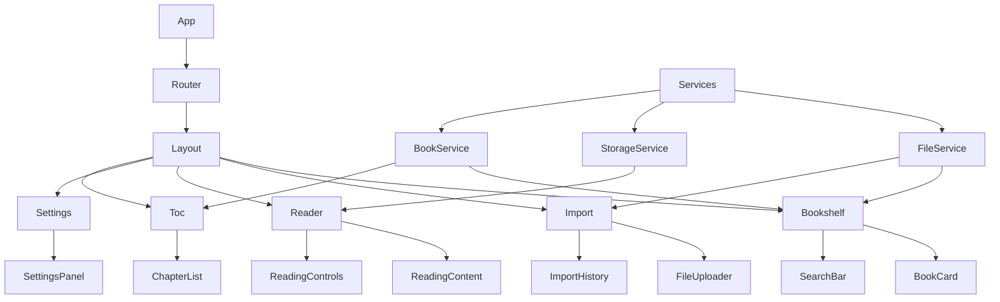

# 小说阅读器应用设计文档

## Overview

小说阅读器是一个现代化的Web应用，提供小说文件导入、管理和阅读功能。应用采用React + TypeScript技术栈，使用shadcn/ui组件库和Tailwind CSS进行样式设计，支持TXT和EPUB格式的小说文件，提供优秀的阅读体验和个性化设置。

## Steering Document Alignment

### Technical Standards (tech.md)

- 遵循React 19+最佳实践，使用函数组件和Hooks
- 采用TypeScript进行类型安全开发
- 使用Vite作为构建工具，确保快速开发和构建
- 遵循现代Web标准，支持响应式设计

### Project Structure (structure.md)

- 采用模块化组件架构，按功能域组织代码
- 使用shadcn/ui组件库保持UI一致性
- 遵循Vite项目结构规范
- 实现清晰的关注点分离

## Code Reuse Analysis

### Existing Components to Leverage

- **Button组件**: 使用现有的shadcn/ui Button组件，支持多种变体和尺寸
- **cn工具函数**: 利用现有的clsx和tailwind-merge工具进行样式合并
- **Tailwind CSS配置**: 复用现有的设计系统和颜色主题
- **Lucide React图标**: 使用现有的图标库保持视觉一致性

### Integration Points

- **React Router v7**: 集成路由系统进行页面导航
- **本地存储**: 使用localStorage/IndexedDB进行数据持久化
- **文件API**: 集成浏览器文件API进行文件上传和处理

## Architecture

### Modular Design Principles

- **Single File Responsibility**: 每个组件文件专注于单一功能
- **Component Isolation**: 创建小型、专注的组件而非大型单体文件
- **Service Layer Separation**: 分离数据访问、业务逻辑和展示层
- **Utility Modularity**: 将工具函数分解为专注的单一用途模块



## Components and Interfaces

### Layout Component

- **Purpose:** 提供应用的整体布局结构，包含导航和内容区域
- **Interfaces:** 使用React Router的Outlet进行子路由渲染
- **Dependencies:** React Router, shadcn/ui组件
- **Reuses:** 现有的Button组件和样式系统

### Bookshelf Component

- **Purpose:** 显示用户的小说收藏列表，支持搜索和排序
- **Interfaces:** 展示图书卡片网格，提供导入和搜索功能
- **Dependencies:** BookService, StorageService
- **Reuses:** BookCard组件，SearchBar组件

### Import Component

- **Purpose:** 处理小说文件导入，支持拖拽上传和文件选择
- **Interfaces:** 文件上传区域，格式说明，导入历史
- **Dependencies:** FileService, File API
- **Reuses:** FileUploader组件，ImportHistory组件

### Reader Component

- **Purpose:** 提供小说阅读界面，支持章节导航和阅读设置
- **Interfaces:** 阅读内容显示，工具栏，进度控制
- **Dependencies:** BookService, StorageService
- **Reuses:** ReadingContent组件，ReadingControls组件

### Settings Component

- **Purpose:** 管理用户设置，包括阅读偏好和主题配置
- **Interfaces:** 设置面板，主题选择器，开关控件
- **Dependencies:** StorageService
- **Reuses:** SettingsPanel组件，主题系统

### Toc Component

- **Purpose:** 显示章节目录，支持章节跳转和搜索
- **Interfaces:** 章节列表，快速跳转，搜索功能
- **Dependencies:** BookService
- **Reuses:** ChapterList组件，SearchBar组件

## Data Models

### Book Model

```typescript
interface Book {
  id: string
  title: string
  author: string
  cover?: string
  format: 'txt' | 'epub'
  fileSize: number
  totalChapters: number
  currentChapter: number
  progress: number
  lastReadAt: Date
  createdAt: Date
  chapters: Chapter[]
}
```

### Chapter Model

```typescript
interface Chapter {
  id: string
  bookId: string
  title: string
  content: string
  order: number
  isRead: boolean
  readProgress: number
}
```

### ReadingSettings Model

```typescript
interface ReadingSettings {
  fontSize: number
  lineHeight: number
  readingMode: 'single' | 'double'
  theme: 'default' | 'sepia' | 'dark' | 'green'
  nightMode: boolean
  autoSave: boolean
  shareEnabled: boolean
}
```

### ImportHistory Model

```typescript
interface ImportHistory {
  id: string
  fileName: string
  fileSize: number
  format: 'txt' | 'epub'
  status: 'success' | 'failed' | 'processing'
  importedAt: Date
  bookId?: string
}
```

## Error Handling

### Error Scenarios

1. **文件导入失败**
   - **Handling:** 显示错误提示，记录失败原因，提供重试选项
   - **User Impact:** 用户看到友好的错误消息和解决建议

2. **文件格式不支持**
   - **Handling:** 验证文件类型，显示支持的格式说明
   - **User Impact:** 用户了解支持的格式并可以重新选择文件

3. **存储空间不足**
   - **Handling:** 检查可用空间，提示用户清理或删除旧文件
   - **User Impact:** 用户收到空间不足警告和清理建议

4. **章节内容加载失败**
   - **Handling:** 显示加载错误，提供重新加载选项
   - **User Impact:** 用户可以选择重新加载或返回上一章节

5. **设置保存失败**
   - **Handling:** 使用本地存储备份，显示保存状态
   - **User Impact:** 用户了解设置状态，可以手动重试

## Testing Strategy

### Unit Testing

- 使用Vitest进行组件单元测试
- 测试组件渲染、用户交互和状态管理
- 重点测试文件处理、数据转换和存储逻辑

### Integration Testing

- 测试组件间的数据流和交互
- 验证路由导航和页面切换
- 测试文件上传和解析流程

### End-to-End Testing

- 使用Playwright进行E2E测试
- 测试完整的用户流程：导入→阅读→设置
- 验证跨浏览器兼容性和响应式设计
